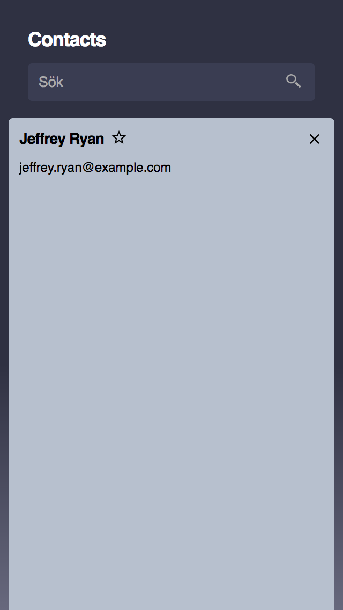

Kodprov frontend
================
Det här är ett kodprov för dig som söker jobb som frontend-utvecklare hos Beamon People.  

Uppgiften
---------
Här är en enkel webbapp för att visa en kontaktlista. Det går att se detaljer
om en kontakt och markera den som favorit. Det finns även en sökfunktion och
möjlighet att filtrera favoriter.  

Den nuvarande versionen av koden innehåller flera exempel på mindre bra kod.
Din uppgift är att refaktorera och förbättra koden för att visa dina kunskaper
inom olika delar av frontend-utveckling så som markup, javascript och styling.  

Du ska även ändra webbappens utseende så att det matchar designbilderna sist i detta
dokument (det behöver inte vara pixel-perfekt).  

Tveka  inte  att  fråga  om  du  undrar  något!  Lycka  till!  

Färger
------
Här är de färger som används i designen:  
`#2f3142`  
`#67687d`  
`#fff`  
`#000`  
`#3a3d52`  
`#aaa`  
`#3a3d52`  
`#4e536f`  
`#b7c0ce`  

Designbilder
------------  
  
Överblicksvy: Lista över kontakter  

  
Detaljerad vy: Kontaktuppgifter för en person  
